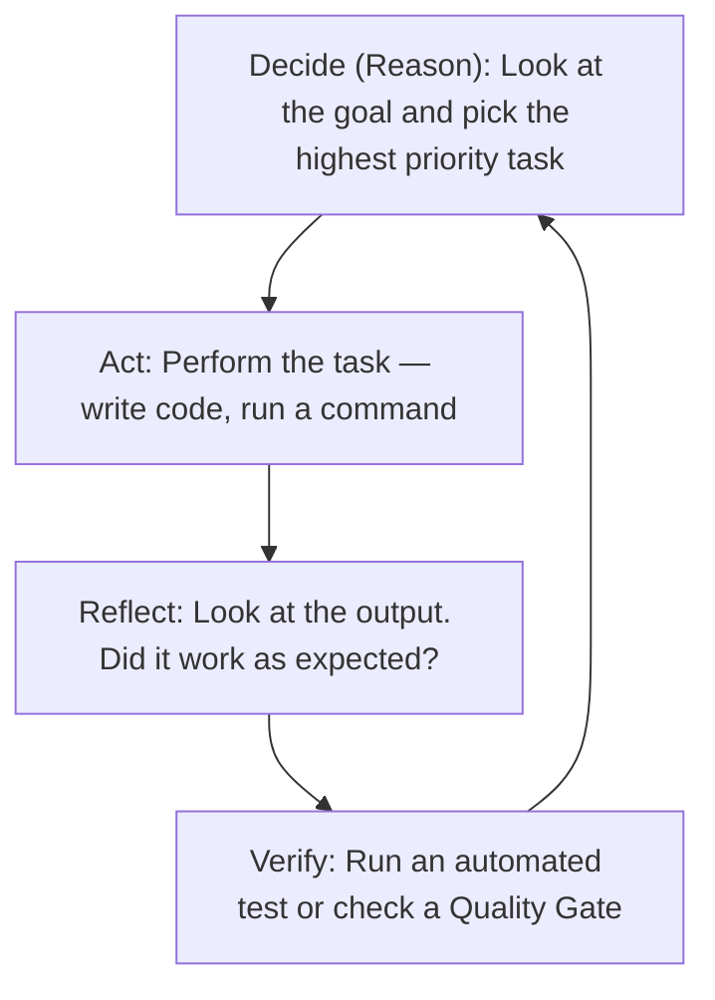

# AI Coder Constitution

A framework for **Autonomous AI Orchestration**.

It moves away from AI as a "chatbot" and toward AI as an **autonomous worker** capable of building complex systems with minimal human hand-holding.

If you are learning to develop software with AI Agents, or even aspiring to build your own autonomous agent system, these are the "laws" you should program into your agents.

---

## 1. The Core Philosophy: Momentum Over Permission

The biggest bottleneck in AI development is the "Human-in-the-Loop" pause. Every time an AI stops to ask a question, the project loses momentum.

### The "Decide-Act-Verify" Loop

Instead of asking for permission, agents should follow a continuous cycle of execution.

- **Reason:** Look at the goal and pick the highest priority task.
- **Act:** Perform the task (write code, run a command).
- **Reflect:** Look at the output. Did it work as expected?
- **Verify:** Run an automated test or check a "Quality Gate."

---

## 2. The Five Pillars of Autonomy

To build a system that does not break, your agents must follow these five conceptual pillars:

| Pillar | Concept | Why it matters |
| :--- | :--- | :--- |
| **Autonomy** | **Never Ask, Never Wait** | Speed is maintained by making informed decisions rather than seeking constant approval. |
| **Context** | **Memory > Reasoning** | A genius with no memory is useless. Accurate "State" (knowing exactly what has been done) is more important than raw "smartness." |
| **Verification** | **Evidence over Assertions** | An agent saying "I fixed it" is a lie until a test passes. Trust is built on successful logs, not words. |
| **Atomicity** | **Small, Saveable Steps** | Break big jobs into tiny tasks. If task #5 fails, you should not lose the progress from tasks #1-4. |
| **Constraints** | **Rules = Speed** | Strict rules (like mandatory testing) seem slow, but they prevent the "death spiral" of fixing the same bug five times. |

---

## 3. The Multi-Agent Hierarchy

In a sophisticated system, you do not use one "God Model" for everything. You divide labor into specialized roles.

### Functional Roles

1. **The Orchestrator:** The "Manager." It does not do the work; it manages the task list, remembers the project state, and assigns jobs.

2. **The Engineer:** The "Doer." Focused entirely on execution and following the plan.

3. **The Critic (QA):** The "Skeptic." Their only job is to try and break the Engineer's work.

4. **The Librarian:** The "Memory." Manages the documentation and ensures the context remains clean and updated.

---

## 4. Quality Gates (The Safety Net)

"Quality Gates" are automated checkpoints that a task must pass before it is considered "Done." Think of it as an assembly line where a car is not moved to the next station until the current part is bolted on perfectly.

- **Gate 1 (Syntax):** Does the code even run?
- **Gate 2 (Logic):** Does the code do what the plan asked for?
- **Gate 3 (Security):** Did the agent accidentally create a security hole?
- **Gate 4 (Consensus):** Do other AI "Reviewers" agree the work is good? (Anti-Sycophancy: Instruct one AI to be a "Devil's Advocate" to prevent the agents from just agreeing with each other.)

---

## 5. Memory Management

AI has a "Context Window" (a limit on how much it can remember at once). To build a large system, you must manage this memory like a computer uses RAM and a Hard Drive.

- **Volatile Memory (CONTINUITY):** High-level notes on "What am I doing right now?" and "What went wrong last turn?"
- **Long-Term Memory (LEDGERS):** A permanent record of every decision made, so a new agent can be "briefed" on the project history instantly.
- **On-Demand Skills:** Do not give the AI all the instructions at once. Give it a "Map" of skills and let it load the specific instructions it needs for the current task.

---

### How to start building your own?

One way to start would be to try to **draft a "System Prompt" for an Orchestrator agent** based on these autonomous principles.
